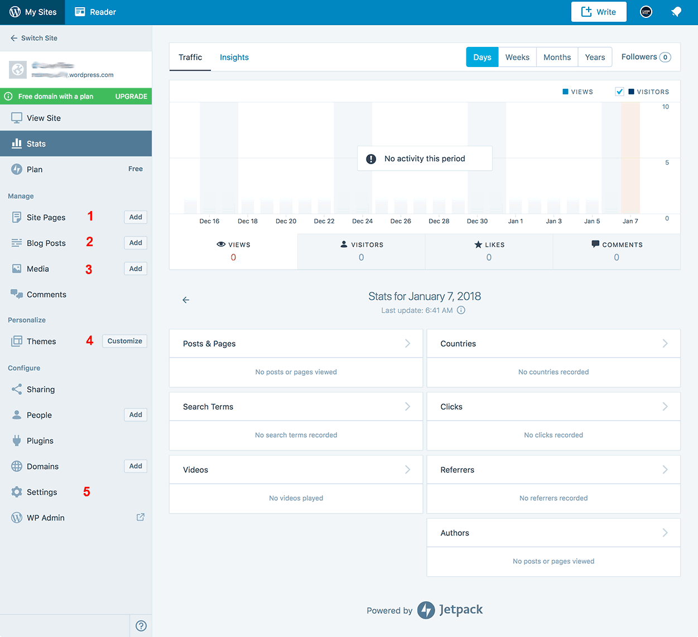
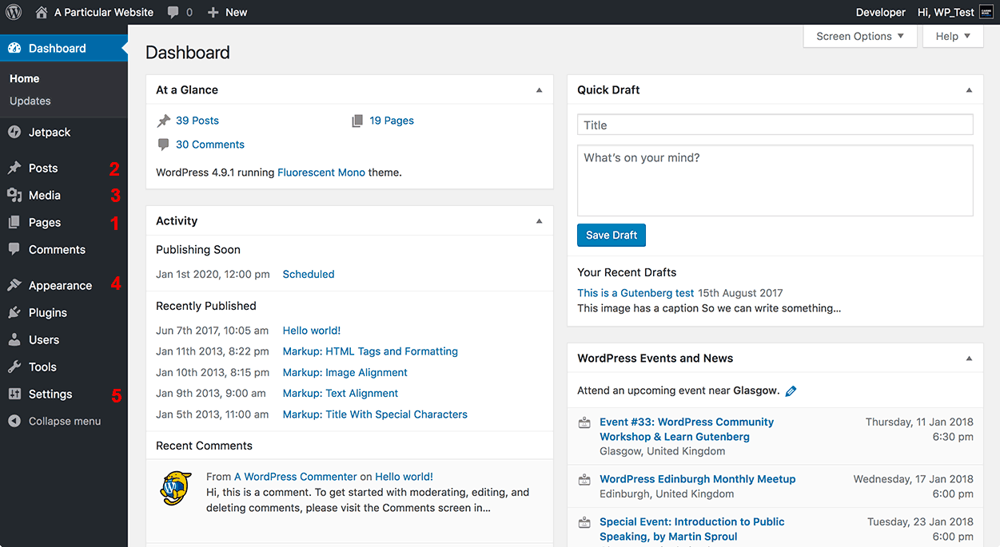

# WordPress 0

**What we will learn today?**
- [What is Open Source? GPL and MIT Licenses](#what-is-open-source-gpl-and-mit-licenses)
- [What is WordPress? WordPress.com versus WordPress.org](#what-is-wordpress-wordpresscom-versus-wordpressorg)
- [What do WordPress developers do?](#what-do-wordpress-developers-do)
- [The WordPress development environment](#the-wordpress-development-environment)
- [Homework](#homework)
---

## What is Open Source? GPL and MIT Licenses

In 1984, Richard Stallman launched the **GNU Project** and created the **General Public License** (GPL) as a response to his increasing unhappiness with proprietary software, vendor lock-in practices and the resulting loss of personal freedom, as he saw it.

> "When users don't control the program, we call it 'nonfree' or 'proprietary' software. The nonfree program controls the users, and the developer controls the program; this makes the program an instrument of unjust power."
> - Richard Stallman, [The Free Software Definition](https://www.gnu.org/philosophy/free-sw.html)

This marked the birth of **Free Software**, by which software is considered free if it respects the 4 fundamental freedoms:

1. Anyone has the freedom to run the software as they wish, for any purpose
2. Anyone has the freedom to study how the program works, and change it as they wish
3. Anyone has the freedom to redistribute the software
4. Anyone has the freedom to distribute copies of their own modified version of the Software

As a consequence, access to the code must be open and all 3rd party software needed to run it must also comply with the 4 fundamental freedoms.

A few years later, in 1997, Eric Raymond wrote an essay called **"The Cathedral and the Bazaar"**, in which he described how the Linux operating system and the Free Software philosophy had created a surprisingly effective and collaborative way of writing software.

This set the stage for the appearance, one year later, of the term **Open Source** software. Open Source software is a close relative of Free Software but with a stronger focus on the methodology rather than the philosophy.

The movement has continued growing since then and nowadays there are many examples of popular Open Source software such as, for example, WordPress, Firefox, React, Python, Node, the Apache and NGINX web servers, just to mention a few.

For example, Node Package Manager is a system for distributing open source code. When someone writes `npm install XXX` they are taking advantage of a vast ecosystem of open source code.

> **Exercise:** Find out more examples of Open Source software.
>
> **Exercise:** Can you think of any software that is "free" (as in you pay £0.00 for it) but would not qualify as Open Source?

### Copyleft, GPL and MIT

**Copyleft** is a method for making a program compliant with the 4 freedoms of Free Software, and requiring that all modified and extended versions of the program also be compliant.

According to the GNU Project:

> Certain kinds of rules about the manner of distributing free software are acceptable, when they don't conflict with the central freedoms. For example, copyleft (very simply stated) is the rule that when redistributing the program, you cannot add restrictions to deny other people the central freedoms.
>
> Copyleft also provides an incentive for other programmers to add to free software [...] and helps programmers who want to contribute improvements to Free Software get permission to do so.

This Copyleft rule translates into the **General Public License (GPL) Licence** for distribution with the Open Source software in question.

The **MIT License** is another popular Open Source software license that was originally developed at the Massachusetts Institute of Technology. Unlike the GPL, the only requirement an MIT license places on its recipients is that they keep the original copyright notice intact when they repurpose, redistribute, or otherwise reuse the code.

> "Copyright <YEAR> <COPYRIGHT HOLDER>
>
> Permission is hereby granted, free of charge, to any person obtaining a copy of this software and associated documentation files (the "Software"), to deal in the Software without restriction, including without limitation the rights to use, copy, modify, merge, publish, distribute, sublicense, and/or sell copies of the Software, and to permit persons to whom the Software is furnished to do so, subject to the following conditions:
>
> The above copyright notice and this permission notice shall be included in all copies or substantial portions of the Software.
>
> THE SOFTWARE IS PROVIDED "AS IS", WITHOUT WARRANTY OF ANY KIND, EXPRESS OR IMPLIED, INCLUDING BUT NOT LIMITED TO THE WARRANTIES OF MERCHANTABILITY, FITNESS FOR A PARTICULAR PURPOSE AND NONINFRINGEMENT. IN NO EVENT SHALL THE AUTHORS OR COPYRIGHT HOLDERS BE LIABLE FOR ANY CLAIM, DAMAGES OR OTHER LIABILITY, WHETHER IN AN ACTION OF CONTRACT, TORT OR OTHERWISE, ARISING FROM, OUT OF OR IN CONNECTION WITH THE SOFTWARE OR THE USE OR OTHER DEALINGS IN THE SOFTWARE."
>
> The MIT License, from [The Open Source Initiative website](https://opensource.org/licenses/MIT)

In practical terms, the main difference is that GPL says that if you use my GPL code in your released code, you must also release your code under the GPL or something similar. MIT is very similar to GPL except that if you use my GPL code in your released code, you're allowed to license your part of the code in other non-Open Source ways.

So GPL "coerces" Open Source on anything that uses it whereas MIT is more flexible. There are good reasons for using both and many amongst the WordPress core developers are very committed to the coercive nature of GPL. But many big companies are suspicious of it.

If you wish to find out more about Free Software, Open Source and licensing, please watch the excellent documentary ["Revolution OS"](https://www.youtube.com/watch?v=4vW62KqKJ5A) on YouTube.


These sections have been sourced from:
* [GNU - Free Software Definition](https://www.gnu.org/philosophy/free-sw.html)
* [GNU - What is Copyleft?](https://www.gnu.org/copyleft/copyleft.html)
* [Make WordPress Training - What is Open Source](https://make.wordpress.org/training/handbook/user-lessons/what-is-open-source/)
* [Opensource.com - What's the difference between open source software and free software?](https://opensource.com/article/17/11/open-source-or-free-software)


## What is WordPress? WordPress.com versus WordPress.org

WordPress is an Open Source Content Management System (CMS), released in 2003 by Matt Mullenweg and Mike Little. As of 2017, it has 59% of the CMS marketshare and 28% of all websites, worldwide.

Although WordPress started as a blogging platform, it can also be used for building websites (large and small), e-commerce sites (with the WooCommerce plugin), private community platforms (with the BuddyPress plugin), forums (with the bbPress plugin), etc.

Some examples of these could be: [Kinning Park Complex](http://www.kinningparkcomplex.org/), [Sony Music](https://www.sonymusic.com/), [Duracell Lighting](http://www.duracelllighting.com/), and [The Rolling Stones](http://www.rollingstones.com/)

The introduction of the Rest API into WordPress core a couple of years ago, has also made it possible to write web or mobile apps that link into WordPress. We will cover the Rest API later on in the course.

> **Exercise:** Find out what a Content Management System (CMS) is. Can you find another example of a popular CMS?
>
> **Exercise:** Find more examples of WordPress sites, by type: a blog, a local business website, an e-commerce website, a news site, etc. Which is your favourite? What do you like about it?


### WordPress.com versus WordPress.org

In certain situations, there is a slight confusion about why sometimes we talk about WordPress.com and other times we say WordPress.org. Aren't they both the same?

Unfortunately, the short answer is "Yes and No"... which does not help!

So, just to set the record straight, when we talk about WordPress, we mean **WordPress.org**. The Open Source software that you can download for free from the website with the same domain name.

On the other hand, **WordPress.com** is a massive multisite installation of WordPress owned by **Automattic**, which is in turn owned by Matt Mullenweg, one of the two original WordPress developers.

So basically, WordPress.com runs WordPress and, therefore, the main concepts are the same for both. They both have Pages and Posts, Categories and Tags, a Media Gallery, a Customizer and Settings pages, etc.

Even so, their Dashboards (the main screen the user sees after login) look quite different:


_A screengrab of the wordpress.com dashboard._


_A screengrab of the wordpress.org dashboard._

Remember the 4 freedoms? You are free to modify the software and free to distribute the modification!

But the Dashboard is not the only difference between the two. Although WordPress.com can be free if you have a Free Plan, you are restricted from doing a lot of things unless you upgrade to a paid plan, such as, for example, linking the site to your own domain or installing any plugins to extend functionality.  

Whereas with WordPress.org there are no restrictions whatsoever, but you need to install it on your own host, with your own domain and either do the site maintenance yourself or hire someone to do it for you.

And here is where WordPress developers come in...

## What do WordPress developers do?

As an IT professional, there's several different ways of working with WordPress:

*   You can build and maintain websites for clients using, and adapting, existing WordPress **Themes** ( = collection of templates for the frontend ) and **Plugins** ( = extensions to the default WordPress functionality ).
*   You can create WordPress Themes for clients or to sell them on platforms such as the [Theme Directory](https://en-gb.wordpress.org/themes/) or the [ThemeForest](https://themeforest.net).
*   You can create WordPress Plugins for clients or to sell on the [Plugin Directory](https://en-gb.wordpress.org/plugins/).

Of course, you can also earn a living as a content editor, a blogger or a business owner with a WordPress website. But that topic is outside the scope of this course ;-) .

We will cover Themes and Plugins extensively during the course but, in the meantime, if you want to find out more, please refer to the following links in the WordPress Codex:

* [WordPress Developers Handbook - What is a Theme](https://developer.wordpress.org/themes/getting-started/what-is-a-theme/)
* [WordPress Developers Handbook - What is a Plugin](https://developer.wordpress.org/plugins/intro/what-is-a-plugin/)


## The WordPress development environment

_This tutorial is based on my [original blog post](https://wptavern.com/composing-a-wordpress-development-environment-with-docker) on The WordPress Tavern._

**If you don't care about what Docker is for now, feel free to jump to the part where we actually [spin up a WordPress Docker container](#hello-wordpress).**

In the last few years, a wave of virtualization technologies have swept through our WordPress development environments. The one that has sounded the most promising to me has been Docker: lightweight and flexible. Yet, until recently, getting Docker up and running was an overwhelming task – especially on a non-Linux machine. Getting Docker to work required running it inside of a virtual Linux machine and configuring stuff like port forwarding and other parts of the network yourself.

Let's take a quick break and explain what a virtual machine is: Different kinds of software requires different operating systems to run. If you want to run a Windows program on a Mac computer, you can install a virtual Windows machine on your Mac. When we do web development, most of our software will be running on servers using the Linux operating system. Therefore, it is beneficial for us to utilise virtual machines to run Linux on our development machines as well. The more we can replicate the environment where our code will eventually be running, the less uncomfortable errors we will probably encounter. Historically, using virtual machines have had 2 main obstacles: 1. they are really slow and resource intensive - especially if you run a few of them at the same time. If you run 3 virtual machines with Linux, your computer's hardware is actually running 4 computers worth of operating systems all at once. 2. configuring the network is not very easy. If you go to `localhost` in your browser, is it _your_ `localhost` or the virtual machine's `localhost`? The answer is "it depends"!

Btw. if your computer is already running Linux, using Docker is still preferable, but we will get to that later.

Now it’s different.

With (a stable) Docker for Mac and Windows and Docker Compose at hand, getting Docker up and running is easy and pain-free. With Docker Compose you can tell Docker exactly what you want your WordPress development environment to look like and it will take care of it.

### What goes into a WordPress development environment?

In order to run a basic WordPress installation, we need a few things:

- A web server, such as Apache or Nginx
- A PHP executable to run PHP code (WordPress is written in the PHP language)
- The actual WordPress source code
- A SQL database for WordPress to store our content

Thankfully, most of this has been taken care of for us when we use Docker.

### What is Docker?

Docker is a technology that makes it really simple to create isolated containers for your applications and websites to run in. These containers can be combined and modified to fit the needs of your applications. Docker is utilizing the Linux Containers technology (LXC) where multiple isolated environments can share the same Linux kernel. Think of a Docker container as a very lightweight virtual machine. This basically means that you can have separate "virtual machines" for all your different projects, but sharing the same operating system behind the scenes.

The Docker ecosystem is built around these containers. In the [Docker Hub](https://hub.docker.com/), you can find an endless number of containers that other people have built, including containers with WordPress already installed, or you can build your own using a Dockerfile.

### What is Docker Compose?

Docker Compose is what makes Docker available to mortals like you and me. As the name implies, Docker Compose is a tool for composing Docker containers. That means defining your services (containers), setting up the network between them, sharing local directories with them, and a few more things.

With Docker Compose you create a simple file in the root of your project that describes the setup required by your application/website. For a WordPress theme that might mean a container to run WordPress, a container to run MySQL and a container to run NPM.

### Hello WordPress!

Okay, it's time to get the ball rolling. First of all, you need Docker installed on your computer. So please go ahead and install Docker CE (community edition):

* [Mac](https://www.docker.com/docker-mac)
* [Ubuntu](https://www.docker.com/docker-ubuntu)
* [Windows](https://www.docker.com/docker-windows)

The process should be fairly straightforward.

Next thing, create a folder somewhere on your machine and name it something "my-wordpress-site". In Terminal:

```bash
$ mkdir my-wordpress-site
```

Next, we are ready to create our `docker-compose.yml` config file. This is actually all we need to spin up a WordPress site inside of a Docker container. Here's how a very basic `docker-compose.yml` file could look:

```yaml
version: '2'

services:
  db:
    image: mysql:5.7
    ports:
      - "3306:3306"
    volumes:
      - my_wp_site_db_data:/var/lib/mysql
    restart: always
    environment:
      MYSQL_ROOT_PASSWORD: wordpress
      MYSQL_DATABASE: wordpress
      MYSQL_USER: wordpress
      MYSQL_PASSWORD: secret

  wordpress:
    depends_on:
      - db
    image: wordpress:php5.6-apache
    ports:
      - "80:80"
    volumes:
      - my_wp_site_wp_content:/var/www/html/wp-content
    restart: always
    environment:
      WORDPRESS_DB_HOST: db:3306
      WORDPRESS_DB_PASSWORD: wordpress

volumes:
  my_wp_site_db_data:
    driver: "local"
  my_wp_site_wp_content:
    driver: "local"
```

You can copy and paste the file content into a file called `docker-compose.yml` inside of the "my-wordpress-site" folder.

Try to run `docker-compose up -d` in your Terminal to spin up the WordPress environment. If all goes well, you should see something like this:

```bash
Creating network "wordpressdockerexample_default" with the default driver
Creating volume "wordpressdockerexample_my_wp_site_wp_content" with local driver
Creating wordpressdockerexample_db_1 ...
Creating wordpressdockerexample_db_1 ... done
Creating wordpressdockerexample_wordpress_1 ...
Creating wordpressdockerexample_wordpress_1 ... done
```

Go visit http://localhost in your browser and you will be presented with the famous 5-minute installation of WordPress. That should be fairly self-explaining and after doing that your WordPress site is up and running.

If you want to see which Docker containers are running, you can always run `docker ps`:

```bash
$ docker ps

CONTAINER ID        IMAGE                     PORTS
457c48ca8328        wordpress:php5.6-apache   0.0.0.0:80->80/tcp       ...
e77876ff7ac2        mysql:5.7                 0.0.0.0:3306->3306/tcp   ...
```

And finally if you want to stop your containers, you can simply run `docker-compose down`.

If you want to understand what's in the `docker-compose.yml` file, feel free to have a look at Appendix 2 - however, this is by no means required reading.

------

_**Troubleshooting:** The part that usually goes wrong here is the port forwarding. Going to http://localhost in your browser is the same thing as going to http://localhost:80 AKA port 80 on your local host. If something else is already running on port 80 (ie. you have another web server installed locally) you will need to change the file to use another port:_

```yml
ports:
  - "80:8888"
```

_The same goes with the database if you already have MySQL running on port 3306 locally._

### Working with plugins and themes in our container

If you want to develop your own WordPress plugin or theme you can bundle this WordPress environment with your project. Let's say you want to work on a WordPress plugin called "My Awesome WP Plugin", first create a folder for your plugin:

```bash
$ mkdir my-awesome-wp-plugin
```

Next, copy and paste the `docker-compose.yml` into the project folder. You then need to add an extra line to the `volumes` section of the `wordpress` service:

```yml
volumes:
  - my_wp_site_wp_content:/var/www/html/wp-content
  - .:/var/www/html/wp-content/themes/my-wordpress-site/ # add this line
```

Can you guess what that line does? It maps the current directory on your local machine (represented by a ".") to a folder named "my-awesome-wp-plugin" inside of the Docker container. The "my-awesome-wp-plugin" folder will be located inside of the "/wp-content/plugins" folder, which is where WordPress looks for plugin files.

If you are working on a WordPress theme instead, the process will be exactly the same, only the folder will be inside of "/wp-content/themes" instead.

## Resources

1.  [Easy WP Guide WordPress Manual](https://easywpguide.com/)
2.  [WordPress Codex](https://codex.wordpress.org)
3.  [WordPress TV](https://wordpress.tv)
4.  ["The Cathedral and the Bazaar" by Eric S. Raymond](http://www.catb.org/~esr/writings/cathedral-bazaar/cathedral-bazaar/index.html)

## Homework

1.  **Create a blog with WordPress.com** \- The objective of this exercise is to help you become familiar with the key WordPress concepts.

    1.  Create a free account on wordpress.com and choose a name for the blog.
    2.  Choose a Theme.
    3.  Add an About page and type some content. A couple of lines will be enough.
    4.  Create a new Post and type some content.
    5.  Set the site language to English UK.
    6.  Choose to show only 3 posts per page and allow comments on posts, but comments should be approved by an administrator before being displayed.
    7.  Find a Copyright-free image with an appropriate size and use it as the site's header.
    8.  Add a menu with the following items: Home, About and Contact. "Home" should link to the main blog page and "Contact" should link to an email address.

    Do as many of the tasks below as you can but don't worry if you get stuck with any of the steps. There is a lot of information in the [WordPress.com support site](https://en.support.wordpress.com/) or, if you can't find a solution there, please ask on Slack.

2.  **Setup your localhost with Docker**
    1.  Follow the Docker tutorial above and make sure you have a local WordPress development environment ready for class.
    2.  Once you have succesfully set it up post an update on Slack, or ask for help if you are struggling to complete
    3.  Login to the admin interface of your Docker WordPress install and look around. Try replicating some of the steps you completed above for your WordPress.com account in your Docker install — do you notice many differences with the WordPress.com admin interface?

3.  **Explore and install a plugin**
    1. Find the plugins section (under Plugins > Add New). Search for a 'contact form' plugin (use the Search field in the top right).

        - **Don’t just install the first one in the search results** - read reviews, look at screenshots, read the installation instructions and consider what one to choose.

    2. Install and Activate your chosen plugin.

## Appendix 1: Why Docker?

There are a few reasons why Docker is an attractive technology for me. Here are the most important requirements I have for my development environment and how Docker solves them:

* **Clean machine:** In an ideal world, I prefer not to install anything related to my development environment directly on my own computer. I work on so many different projects that this gets unmanageable. When one thing works, another doesn’t. I also travel a lot and should something happen to my computer, I want to be able to set up a new machine in minutes.
* **Shareable:** I often work in teams, so sharing my development environment with teammates is crucial.
* **Lightweight:** This is important, especially when on the road. Try running a few Vagrant boxes compared to a few Docker containers and see what I mean.
* **Extendable:** Extending Docker is very easy. For example, I could extend the official WordPress container and build it with a specific plugin or theme.
* **Mirror production:** My development environment needs to be as close to production as possible. With Docker this is easy, since Docker can be used in production as well.

## Appendix 2: What's in our Docker Compose file?

Let's quickly walk through what's in our `docker-compose.yml` file:

First of all, we define 2 _services_ - a `wordpress` service and a `db` service. The `db` service is using the official `mysql` Docker container image and it is is using the one that is tagged `5.7`. The `wordpress` service is using the official `wordpress` image, which comes pre-packaged with WordPress, PHP and a web server. Specifically, we are using the one that is tagged `php5.6-apache` because we are using PHP 5.6 and the Apache web server. There are a ton of different versions of the official `wordpress` image [on the Docker Hub](https://hub.docker.com/_/wordpress/).

Next we use the `ports` section to tell Docker Compose how to forward the ports of the Docker containers to our local machine. By forwarding port 3306 of the database container to our local port 3306, we can easily connect to the database locally from our own machine. By forwarding port 80 of the WordPress container to our local port 80, we can access the WordPress install directly via our browser.

Each service also has a `volumes` section. Each of these volumes map a folder inside of the container to our local machine. This is important because our Docker containers are completely wiped every time we turn them off. So if we want our data to persist across sessions, we need Docker to store the data on our local machine and not only inside of the container. For WordPress, we mount the `wp-content` folder to our local machine because this folder is where WordPress stores plugins, themes and uploads as we add these to our WordPress site.
