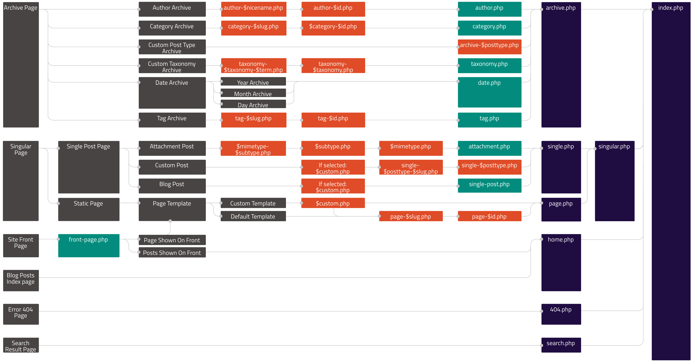

# WordPress Lesson 1

** What we will learn today?**
- [One](#one)
- [Two](#two)
- [The Template Hierarchy](#the-template-hierarchy)
- [Child Themes](#child-themes)
- [The WordPress Loop](#the-Wordpress-loop)
- [Homework](#homework)
---

**Before we begin...**

* You should have finished a pre-class lesson that showed you how to set up a local installation of WordPress on your machine using Docker? Let the mentors know if you have not completed this yet.
* WordPress uses the PHP programming language. This module is not designed to teach you PHP. However, we will use uses similar concept to what you have learned so far — variables, functions, arrays, conditional statements and so on. See [PHP Quick Start](#appendix-1-php-quick-start) in the appendix for a short overview.

## One

Para

## Two

Para

## The Template Hierarchy

Whether you are building your own theme, or modifying someone else’s with a child theme (explained later), you will have to understand the WordPress Template Hierarchy. This is the name given to the way WordPress chooses what template file in the current theme to use for each URI (or path) your user visits on your site — what one to use on the home page, the about page, search results page, 404 page and so on.

  > Do you remember when working with node.js you had to deal with routing in your code? WordPress is slightly different — it maps the URI to a template file(s) in your theme based on the rules of the Template Hierarchy.

The choice of template file that WordPress makes can be visualised with the following image representing the Template Hierarchy:

**<a href="https://developer.wordpress.org/files/2014/10/wp-hierarchy.png" target="_blank">View a larger version**</a>

This shows you all the different possible template files you could have in your theme related to the Hierarchy. It may look a little complicated… but the good news is that they are all optional apart from one — the `‘index.php’` file. If you only had this file in your theme ALL pages would use this to output the content on that page. 

> ...you do need one more file in your theme called style.css but this is not related to the Template Hierarchy, it only outputs your styles

So, think of every template file you add after `‘index.php’` as simply allowing you to be more specific about what content outputs to a specific page. Let’s take a look at an example…
 
You should have the WordPress theme called ‘twentyseventeen’ installed and selected — if not, select it now in your WordPress admin under 'Themes'. Then, find the theme files in your local WordPress installation under `/wp-content/themes/twentyseventeen`. As well as the shared template files such as `‘header.php’, ‘footer.php’, ‘functions.php’` and so on there are the following files:
	
* `‘index.php’` — the default layout template file
* `‘front-page.php’` — the template file used for your homepage
* `‘page.php’` — …for pages
* `‘archive.php’` — …for post category archives
* `‘404.php’` — …for the 404 error page

We can see here that the twentyseventeen theme has the default `‘index.php’` but also four other template files that will be used as you browse different parts of your site.

Let’s take your site’s front page (i.e. home page) as an example — what twentyseventeen template file will be used for this…? Will it be `‘index.php’`? Hold on… it is a page, so it will be `‘page.php’` right…? Well, look at the Template Hierarchy image above again and look from left (more specific) to right (less specific). You will hopefully see that the answer is that it will use ‘front-page.php’ as this is more specific and overrides all the others.

Behind the scenes WordPress is doing a similar thing to what we are asking above — it asks itself, ‘What page am I on?’ and then it finds the most specific template file in the current theme available and uses that. This means that, as a theme developer, you have the flexibility to be as specific or as non-specific as you like when deciding what your site looks like.

So, now a quick quiz… (Use the Template Hierarchy image above to help you, the answers are in the Appendix.)

**Exercise 1: Quiz** 

* Q1. Our user is still on the site home page but we have deleted the `‘front-page.php’` file from our theme. What template file will be used for the home page now? 
* Q2. We want to change what outputs on all pages. What template file from above will we need to alter? 
* Q3. We want all pages to be the same apart from an About page that we have created. What do we need to do to have a template file specific to the this page only? (Note: the page URL will be ‘http:///mysite.com/about’)

Now that you have the knowledge to modify theme files, you may be tempted to start changing the your favourite theme’s template files to do what you want. But before you do, consider this — what happens if the theme updates at a later date with new features or bug-fixes? Then there is a good chance you will lose your changes! It is always better to create a child theme.

## Child Themes

Para

## The WordPress Loop

Para

## Resources

1.  [One](https://example.com/)
2.  [Two](https://example.com/)
3.  [Three](https://example.com/)

## Homework

1.  **Excercise** 
2.  **Excercise** 
3.  **Excercise** 
    
## Appendix 1 PHP Quick Start
    
## Appendix 2 Quiz Answers

* A1. ‘page.php’
* A2. ‘page.php’
* A3. We need to create a ‘page-about.php’ template file
