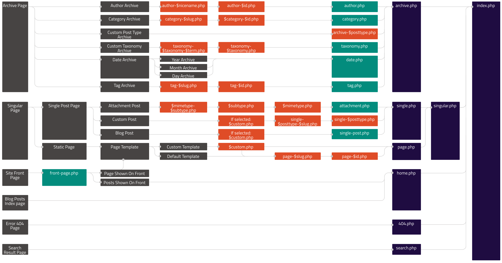

# WordPress Lesson 2

**What we will learn today?**
- [Editing WordPress Themes](#editing-wordPress-themes)
  - [Editing Styles](#editing-styles)
  - [Editing Markup](#editing-markup)
- [The Template Hierarchy](#the-template-hierarchy)
- [The WordPress Loop and WP Query](#the-wordpress-loop-and-wp-query)
- [Homework](#homework)
---

**Before we begin, you should...**

* have read the [project brief](/group-project.md)
* have a local installation of WordPress on your computer
* know where the WordPres theme and plugin folders are on your computer
* be able to login to the WordPress admin

Let the mentors if there are any problems with the above.

---

## Editing WordPress Themes

With WordPress you can get a website up and running very quickly thanks to the thousands of available themes. Themes are what tell WordPress where to get your data (Posts, Pages etc) and how to output it on your site. However, for our group project we are going to start with a very basic 'skeleton' theme and modify it ourselves to suit our exact needs...

> 1. Fork the following Git repo: https://github.com/carmemias/minimalist-theme
> 2. Find the WordPress themes folders are on your computer and `$ git clone` the above repo into it
> 3. Open that folder in a code editor such as Visual Studio Code
> 4. Log in to your WordPress admin and activate the theme from under 'Appearance' > Themes
> 5. View your site. You should see your site laid out with minimal styling.

 Next have a look at the project brief assets provided by the client...

> The [Brand Guidelines](/project-assets/brand-guidelines.md/), the [Layout Design](/project-assets/layout.png) and the [Site Content](/project-assets/site-content.md/)

...and let's start making some changes to our theme as per our client's requirements.

### Editing Styles

We have some brand colours we need to incorporate. Open up `style.css` from the root of the theme folder - this is where all the CSS for the site is contained (some themes may have multiple CSS files). You will see we have some styles in place already. Let's add some brand colours..!

> 1. Scroll to the bottom of the `style.css` file and add a CSS comment of `/* New styles */`, then add some new styles underneath...
> 2. Change the text colour of the site to the brand guideline colour of `#5d5d5d` (grey)
> 3. Change all headings (`h1, h2, h3, h4, h5, h6`) to the brand guideline colour of `#fe951c` (orange)
> 4. Change all links to the brand guideline colour of `#067add` (blue) and a hover/focus colour of `#fe951c` (orange)
> 5. Change the footer background to the brand guideline colour of `#5d5d5d` (grey)

Save the file, refresh the site homepage in your browser and you should see your changes. The client is going to be pleased!

> BONUS: Can you show your design flair and add brand colours to other elements? How about variations of the brand colours? Try change the header background colour to a lighter tint of the brand orange. Hint: try `rgba()`.

### Editing Markup

We've got some nice branding in place but the client also needs us to add a logo to the header and footer. But how and where does the theme output your websites content?

If you look again at our theme folder and open up the `index.php` file. You will see a mix of code in here, some familiar HTML code and also some other code you may not recognise - this is called PHP and is the main programming language WordPress uses. All code between the `<?php` and `?>` tags is PHP, the rest is HTML.

*This module is not designed to teach you PHP. However, although the syntax is a little different, you will be able to use what you have learned so far in JavaScript (such as variables, functions, arrays, conditional statements and so on) to help you.*

> Exercise: Have a look at the some `.php` files in the theme folder. Try to guess what the various parts do.

Near the top of the `index.php` file you will see a call to `get_header();`. This is one of the many functions built in to WordPress to help you get content on to your website. This particular one looks for file in your theme folder called `header.php` and loads it. Likewise, there is a `get_footer()` that loads, you guessed it, the footer.php theme file. And as you'd expect, this is where our site's header and footer content is generated. Let's add our logo to both as required by the client's Layout Design...

> 1. Download the clients [logo](project-assets/brand/logo-text.png) and save it in your theme folder
> 2. Open `header.php` and find the `<div class="site-branding">` element. 
> 3. Just after this element add an `` tag with a `src` attribute with a value of `"logo-text.png"` and an `alt` attribute with a value of `"Glasgow Bike Store logo"`

Save the file, refresh the site homepage in your browser and... hmmm, something's not worked? The reason is the `src` attribute is not quite pointing to the image file in our theme folder. We need to use a bit of PHP in there so it can point to our theme folder. So, try this out:

> `/logo-text.png" alt="Glasgow Bike Store logo" />`

Notice the `src` value - you can see that you can mix PHP code with HTML. Save the file, refresh the site homepage in your browser and. it should work. (If not, make sure you have a copy of the image in the theme folder). It doesn't look great yet however. Let's try the following...

> 1. Make the image smaller. [HINT: You will need to go back to your `style.css` file and find a way of targeting the image]
> 2. Align the text center and give it some margin
> 3. In your themes folder it's a good idea to keep all your images organised in one folder. Put the `logo-text.png` file in a folder called `img`. You will need to update your `src` attribute to include the folder in the path
> 4. BONUS: Can you make the link to the homepage in the header be the logo image instead of text?

Now try and repeat the above exercise with the footer - this time use the alternative [logo](project-assets/brand/logo.png).

## The Template Hierarchy

Whether you are building your own theme, or modifying someone else’s, you will have to understand the WordPress Template Hierarchy. This is the name given to the way WordPress chooses what template file in the current theme to use for each URI (or path) your user visits on your site — what one to use on the home page, the about page, search results page, 404 page and so on.

  > Do you remember when working with node.js you had to deal with routing in your code? WordPress is slightly different — it maps the URI to a template file(s) in your theme based on the rules of the Template Hierarchy.

The choice of template file that WordPress makes can be visualised with the following image representing the Template Hierarchy:



[View a larger version](https://raw.githubusercontent.com/CodeYourFuture/wordpress-module/master/assets/lesson1/wp-hierarchy.png)

This shows you all the different possible template files you could have in your theme related to the Hierarchy. It may look a little complicated… but the good news is that they are all optional apart from one — the `‘index.php’` file. If you only had this file in your theme ALL pages would use this to output the content on that page.

> ...you do need one more file in your theme called style.css but this is not related to the Template Hierarchy, it only outputs your styles

So, think of every template file you add after `‘index.php’` as simply allowing you to be more specific about what content outputs to a specific page. Let’s take a look at an example…

In the themes folder you should have another theme called ‘twentyseventeen’. In here, as well as the shared template files such as `‘header.php’, ‘footer.php’, ‘functions.php’` and so on there are lots of other files that our Minimalist theme doesn't have, including:

* `‘index.php’` — the default layout template file
* `‘front-page.php’` — the template file used for your homepage
* `‘page.php’` — …for pages
* `‘archive.php’` — …for post category archives
* `‘404.php’` — …for the 404 error page

We can see here that the twentyseventeen theme has the default `‘index.php’` but also four other template files that will be used as you browse different parts of your site.

Let’s take your site’s front page (i.e. home page) as an example — what twentyseventeen template file will be used for this…? Will it be `‘index.php’`? Hold on… it is a page, so it will be `‘page.php’` right…? Well, look at the Template Hierarchy image above again and look from left (more specific) to right (less specific). You will hopefully see that the answer is that it will use ‘front-page.php’ as this is more specific and overrides all the others.

Behind the scenes WordPress is doing a similar thing to what we are asking above — it asks itself, ‘What page am I on?’ and then it finds the most specific template file in the current theme available and uses that. This means that, as a theme developer, you have the flexibility to be as specific or as non-specific as you like when deciding what your site looks like.

So, now a quick quiz… (Use the Template Hierarchy image above to help you, the answers are in the Appendix.)

**Exercise: Quiz**

* Q1. Our user is still on the site home page but we have deleted the `‘front-page.php’` file from our theme. What template file will be used for the home page now?
* Q2. We want to change what outputs on all pages. What template file from above will we need to alter?
* Q3. We want all pages to be the same apart from an About page that we have created. What do we need to do to have a template file specific to the this page only? (Note: the page URL will be ‘http:///mysite.com/about’)

Now that you have this knowledge of the Template Hierarchy we can create different layouts for different parts of our site, giving us a lot of flexibility.

> Exercise: In your Minimalist theme folder copy the `index.php` file and rename it to `front-page.php`. Edit this file (add some new HTML elements), save it and load your hompage. Your homepage should be different. Can you explain why?


## The WordPress Loop and WP Query

### The WordPress Loop

> "The Loop" is the main process of WordPress. You use The Loop in your template files to show posts to visitors. You could make templates without The Loop, but you could only display data from one post.

Simply put, the Loop checks if there are posts or pages to be displayed and then displays them. It looks a bit like this:

```
<?php
    if ( have_posts() ) :
        while ( have_posts() ) :
            the_post();
            // Post Content here
        endwhile;
    endif;
?>
```

This is a PHP code block starting with an `if` statement. This has a `have_posts()` condition, which is a built-in WordPress boolean function (i.e. it will return `TRUE` or `FALSE`) that checks the database for content — if `TRUE` the content will be returned and the `while` statement will loop through each result. So, what content will be displayed? Here are some typical examples:

* **The user is viewing a page** — The loop will fetch and display the content of that page
* **The user is viewing a post** — The loop will fetch and display the content of that post
* **The user is browsing a category** — The loop will fetch and display the latest posts in that specific category

You'll find the loop used throughout WordPress themes and is the main way that content is pulled from your database and output onto your site. 

#### The Loop in action

Let's take a look at `index.php` in our Minimalist theme — find it and open it up in your code editor. Can you find where the `while` loop begins and ends?

```
<?php 
/* Start the Loop */
while ( have_posts() ) : the_post();
  get_template_part( 'template-parts/content', '' );
endwhile;
?>
```

The `get_template_part()` line is WordPress function that, as you can guess, gets a template part from elsewhere in our theme.

> This is an example of breaking up code into modular, resuable parts — this is good programming, right? Remember using partials in Handlebars? It's the same idea here.

Let's open the content template part for a page. Find the following file in the twentyseventeen folder and open it:

> `/template-parts/content-page.php`

And you will see the similar to the following: (code has been shortened)

```
<article id="post-<?php the_ID(); ?>" <?php post_class(); ?>>
	<header class="entry-header">
		<?php the_title( '<h1 class="entry-title">', '</h1>' ); ?>
	</header><!-- .entry-header -->

	<?php the_post_thumbnail(); ?>

	<div class="entry-content">
		<?php
		the_content();
		?>
	</div><!-- .entry-content -->

</article>
```

You can see a mixture of HTML (`<article>`, `<header>`, `<h1>` etc) and PHP code. This is the content that will output for each iteration of our `while` loop. Try and edit the code to see what effect it has on the page output.

**Exercise** 

* Can you output the current date after the `<header>` element using HTML?
* Can you make the date dynamic using PHP? Can you add the current time as well? HINT: Google 'PHP date' and remember, any PHP code needs to be in PHP blocks.

## WP_Query

So by now you may be thinking, that's okay but what if I wan't to fetch my own content and display it? Can we use the loop wherever we want? Can we have multiple loops on a page? For this we use WP_Query, a powerful and flexible WordPress class that allows us to use the Loop with our own options (by passing in arguments).

**Exercise** 

* Can you think of reasons why you may want to use WP_Query in your theme? Here a couple of examples, try and think of some more...
  - To fetch and display related posts to the post currently being viewed
  - To display posts from two categories at once

A typical WP_Query code block looks like this:

```
<?php 
// WP_Query arguments
$args = array(
	'post_type' => array( 'post' ), // Set the content type to 'post'
  'category_name' => 'news', // fetch posts in the news category'
	'posts_per_page' => '5', // fetch 5 posts at a time'
	'orderby' => 'rand', // order the posts randomly'
);

// The Query
$queryLatestNews = new WP_Query( $args );

// The Loop
if ( $queryLatestNews->have_posts() ) {
	while ( $queryLatestNews->have_posts() ) {
		$queryLatestNews->the_post();
		// Post Content here
	}
} else {
	echo '<p>Sorry, no posts found</p>';
}

// Restore original Post Data
wp_reset_postdata();
?>
```

First we set our arguments — in the above example we want to fetch five (`'posts_per_page'`), random (`'orderby'`) posts (`'post_type'`) in the news category (`'category_name'`). We then pass this to a new WP_Query instance and use a WordPress Loop to output the results of our query.

> Our loop also has an else statement to handle the output for when there are no results.

> The last line `wp_reset_postdata();` is important — it terminates this WP Query instance and allows to add further instances.

There are lots of available arguments you can pass to WP Query. Have a look at this code snippet and think to yourself how you could use some of these arguments in your theme:

> [Arguments list for WP Query](https://gist.github.com/luetkemj/2023628)

## Further Reading

1.  [The Loop in Action](https://codex.wordpress.org/The_Loop_in_Action)
2.  [WP Query Codex Docs](https://codex.wordpress.org/Class_Reference/WP_Query)
3.  [Interactive WP Query code generator](https://generatewp.com/wp_query/)

## Homework

Continue with your group project. You are trying to make your theme output match the client's layout design - you can create your own design, as long as the main elements are there.

1. For the header:
   - Add the company telephone number
   - Add the menu with links to your 4 main pages
   - Use CSS to layout the header elements to match the client's layout design
2. For the footer:
   - Add the company telephone number
   - Add the social links (check the [Site Content](/project-assets/site-content.md/) for the URLs) 
   - Use CSS to layout the footer elements to match the client's layout design
3. For the home page:
   - Add a Testimonial to match the client's layout design (check the [Site Content](/project-assets/site-content.md/) for the testimonials, or make up your own) 
   - The testimonial should only appear on the homepage. Remember the Template Hierarchy and use it to help guide you where the code should go. [HINT: you can either create a new file in your theme or use a [WordPress conditional tag](https://codex.wordpress.org/Conditional_Tags)]

## Appendix - Quiz Answers

* A1. ‘page.php’
* A2. ‘page.php’
* A3. We need to create a ‘page-about.php’ template file
